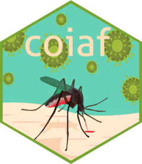

<!-- README.md is generated from README.Rmd. Please edit that file -->

```{r, include = FALSE}
knitr::opts_chunk$set(
  collapse = TRUE,
  comment = "#>",
  fig.path = "man/figures/README-",
  out.width = "100%"
)
```

# coiaf <a href='https://ojwatson.github.io/coiaf/'></a>

```{r logo, eval = F, include = F}
# Code for logo. To run, use the R package `hexSticker`
sticker("man/figures/logo_background.jpg", package="coiaf", 
        filename="man/figures/logo2.png", 
        s_x = 1, s_y = 1, s_width = 1.7,
        p_size = 12, p_x = 0.95, p_y = 1.5, p_color = "#fdead4",
        h_color = "#93a448", h_fill = "#75d8c3",
        white_around_sticker = T, dpi = 500)
```

<!-- badges: start -->
[](https://github.com/OJWatson/coiaf/actions)
[](https://www.tidyverse.org/lifecycle/#stable)
[](https://opensource.org/licenses/MIT)
<!-- badges: end -->

## Introduction
In malaria infections, individuals can often be infected by multiple parasites 
due to repeated mosquito bites or mosquitoes harboring multiple parasites. Such 
mixed infections may represent unrelated strains or parasites that are related. 
The number of strains found in an individual is known as the Complexity of 
Infection (COI). These methods provide insight into the force of infection and 
the parasite population, two measures that are becoming increasingly more 
important as they provide indirect measures of the effectiveness of malaria 
control efforts. Prior methods have been proposed to measure COI, including 
probabilistic likelihood models and Bayesian models. However, a rapid direct 
measure has not yet been developed that truly represents COI. The goal of this 
project is to develop two rapid, direct measures that show equivalent power to 
other well-established methods. In addition, previous methods have utilized 
statistics to determine the relative COI based on the assumption that parasites 
are unrelated, and the second aim will be to incorporate relatedness to provide 
a more unbiased measure in field situations.  

## Installation
To install the package, please follow the code below. In order to install,
`devtools` must be installed.
```{r, eval = FALSE}
# install.packages("devtools")
devtools::install_github("https://github.com/OJWatson/coiaf")
```

## Usage
In order to run real data, please refer to the Articles drop down menu. Several
articles are provided which detail how the algorithm works, how data was 
simulated to test the algorithm, and importantly how to run real data.
A short example on running real data is included and outlines the necessary
data structure as well as the commands to run.

### Development
Please note that this package is still under development and may be missing 
features. This `README` will be updated as the package is developed accordingly.

Features in development:

- [x] Method 2
- [ ] Run the full SNP dataset
- [ ] Statistics for the world map plots (will most likely do bootstrapping)
- [ ] Find a way to convert continuous predictions to discrete predictions
- [ ] Do another round of sensitivity analysis using the continuous method
  - Will need to add a relatedness parameter to the simulated data
