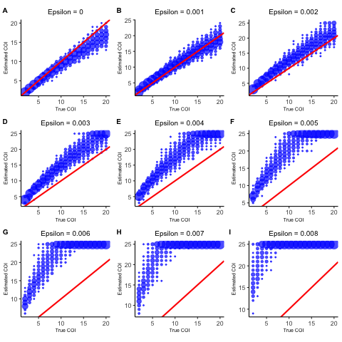
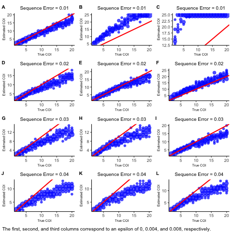

```{r setup, include = FALSE}
knitr::opts_chunk$set(
  comment = "#>",
  tidy = TRUE,
  tidy.opts = list(width.cutoff = 80),
  eval = FALSE
)

library(coiaf)
```

# Introduction

In this analysis file, we aim to understand the effect of varying parameters on
our COI framework. The parameters that we will examine are:

* COI_range: A number indicating the range of COIs to compare the simulated 
data to.
* method: The method to be employed. One of `end`, `ideal`, `overall`.
* dist_method: The distance method used to determine the distance between the 
theoretical and simulated curves for the `overall` method. One of `abs_sum`, 
`sum_abs`, `squared`, `KL`.
* weighted: An indicator indicating whether to compute weighted distance.
* coverage: Coverage at each locus.
* alpha: Shape parameter of the symmetric Dirichlet prior on strain proportions.
* overdispersion: The extent to which counts are over-dispersed relative to the 
binomial distribution. Counts are Beta-binomially distributed, with the beta 
distribution having shape parameters $p/\text{overdispersion}$ and 
$(1-p) / \text{overdispersion}$.
* epsilon: The probability of a single read being miscalled as the other allele.
Applies in both directions.
* seq_error: The level of sequencing error that is assumed.

A note of caution, in order to visualize the following tests, `ggplot2` and
`ggpubr` must be installed.

## Setting our PLAF
```{r initialization}
# Set the seed
set.seed(1)

# Define number of loci, and distribution of minor allele frequencies
L <- 1e3
p <- rbeta(L, 1, 5)
p[p > 0.5] <- 1 - p[p > 0.5]
```

# Sensitivity Analysis

## COI
We first want to understand for what range our model can accurately predict
the COI.

```{r coi}
tcoi <- coi_test(COI = 2:40, repetitions = 100, PLAF = p)

sensitivity_plot(data = tcoi, plot_dims = c(1, 1), title = "COI")

# N.B. to save the plots, we can use the following code. Write this after the
# call to sensitivity_plot().
# %>% ggpubr::ggexport(filename = "analysis/Sensitivity Analysis Figures/tcoi.png")
```

```{r coi image, eval = T, echo = F, out.width = "75%"}
knitr::include_graphics('Sensitivity Analysis Figures/tcoi.png')
```

Based on the above set of runs, it appears that the algorithm performs well for
a very large range of COIs. We see that as the true COI increases, the error
and bias likewise increase. However, even at a COI of 40, the error and bias are
small, at roughly 4 and -4, respectively. It is interesting to note that our
bias is always negative. This indicates that the algorithm consistently 
underpredicts the COI.

The fact that our model struggles with larger COIs makes sense as at that point,
the theoretical COI curves are essentially identical. Although it is remarkable
that the algorithm performs this well at COIs that large, COIs of greater than 
20 are somehwat unrealistic. For the rest of this document, we only consider 
COIs of 2 till 20.

## COI Range
```{r coi range}
tcoi_range <- coi_test(COI = 2:20, COI_range = 10:21, repetitions = 100,
                 PLAF = p, method = "overall", dist_method = "squared")

sensitivity_plot(data = tcoi_range, 
                 plot_dims = c(4, 3), 
                 change_param = "COI Range = ",
                 change_param_val = 10:21)
```

```{r coi range image, eval = T, echo = F, out.width = "75%"}
knitr::include_graphics('Sensitivity Analysis Figures/tcoi_range.png')
```

As expected, the lower the COI range, the lower the error and bias. However,
there does not seem to be a notable difference. Looking at the plotted data, 
even for large COI ranges, the aglorithm performs well. As seen before, the 
algorithm does consistently underpredict the COI. The fact that our model works 
well with large `COI_range` values is promising and implies that our model can 
accurately compute the COI.

## Method
```{r method}
tmethod <- coi_test(COI = 2:20, PLAF = p, method = c("end", "ideal", "overall"),
                    dist_method = "squared", repetitions = 100)

sensitivity_plot(data = tmethod,
                 plot_dims = c(3, 1),
                 change_param = "Method = ",
                 change_param_val = c("End", "Ideal", "Overall"))
```

```{r method image, eval = T, echo = F, out.width = "75%"}

```

Looking at the images for the three methods: `end`, `ideal`, `overall`, it is
clear that the `end` method does not perform particularly well. For low COI
values, more specifically a COI of below 5, the method is accurate. However, 
with a COI of greater than 5, the algorithm consistently over predicts the COI.

The `ideal` method, on the other hand performs quite well. For every COI, it will
for some runs predict the correct COI. However, the distribution is quite large
and the model does not consistently predict the same COI.

The `overall` method seems to perform the best. It does underpredict the COI for 
large COI values but it predicts the same COI consistently.

Based on these results, it seem that the `ideal` method and the `overall` method
are the best. Which one is better is debatable, but for the rest of this 
docuement, we will use the `overall` method.

## Distance Method
```{r distance}
tdistance <- coi_test(COI = 2:20, PLAF = p, method = "overall",
                      dist_method = c("abs_sum", "sum_abs",
                                      "squared", "KL"),
                      repetitions = 100)

sensitivity_plot(data = tdistance,
                 plot_dims = c(2, 2),
                 change_param = "Distance Method = ",
                 change_param_val = c("Absolute Sum", "Sum of Absolute",
                                      "Squared Error", "KL Divergence"))
```

```{r distance image, eval = T, echo = F, out.width = "75%"}

```

All of the distance metrics, other than KL divergence, perform quite well for
all values of the COI. The KL divergecne, although it too performs well, for low
COI values, it struggles in some cases overpredicting and in some cases
underpredicting by a large amount. For a COI of 2, for example, when the 
algorithm uses KL divergence, it predicts COI's much higher than the true COI,
in some cases even predicting a COI of 7.

## Weighted
```{r weight}
tweight <- coi_test(COI = 2:20, weighted = c(FALSE, TRUE),
                    dist_method = c("abs_sum", "sum_abs",
                                      "squared", "KL"),
                    PLAF = p, repetitions = 100)

sensitivity_plot(data = tweight,
                 plot_dims = c(2, 4),
                 change_param_val = 
                   paste(rep(c("Abs Sum", "Sum Abs", 
                                "Squared", "KL"), 2),
                          rep(c("Not Weighted", "Weighted"), each = 4))) 
```

```{r weight image, eval = T, echo = F, out.width = "75%"}

```

Comparing weighted to non-weighted distance metrics, it appears that there is
not a large difference between the algorithm's performance. In general, it 
appears that by weighing the distance, the algorithm does not underpredict as
often, but the difference is very small.

## Coverage
```{r coverage}
tcoverage <- coi_test(COI = 2:20, coverage = c(25, 50, 100, 200, 400, 800), 
                 repetitions = 100, PLAF = p)

sensitivity_plot(data = tcoverage,
                 plot_dims = c(2, 3),
                 change_param = "Coverage = ",
                 change_param_val = c(25, 50, 100, 200, 400, 800))
```

```{r coverage image, eval = T, echo = F, out.width = "75%"}

```

It can be seen, based on the figures, that the lower the coverage is, the worse
our algorithm does. With a coverage greater than 100, however, there is not a
noticable difference in performance.

## Alpha
```{r alpha}
talpha <- coi_test(COI = 2:20, alpha = seq(0.01, 5.51, 0.5), 
                 repetitions = 100, PLAF = p)

sensitivity_plot(data = talpha,
                 plot_dims = c(4, 3),
                 change_param = "Alpha = ",
                 change_param_val = seq(0.01, 5.51, 0.5)) 
```

```{r alpha image, eval = T, echo = F, out.width = "75%"}

```

The larger the value of alpha is, the better our model performs. Greater than an
alpha of 3, however, there is very litte difference. When the alpha is low, the
model will underpredict the true COI.

## Overdispersion
```{r overdispersion}
tover <- coi_test(COI = 2:20, overdispersion = seq(0, 0.2, 0.05), 
                 repetitions = 100, PLAF = p)

sensitivity_plot(data = tover,
                 plot_dims = c(3, 2),
                 change_param = "Overdispersion = ",
                 change_param_val = seq(0, 0.2, 0.05))
```

```{r overdispersion image, eval = T, echo = F, out.width = "75%"}

```

When you introduce overdispersion, models perform poorly. Any overdispersion 
causes a large drop in accuracy.

## Epsilon
```{r epsilon}
tepsilon <- coi_test(COI = 2:20, epsilon = seq(0, 1, 0.1), 
                 repetitions = 100, PLAF = p)

sensitivity_plot(data = tepsilon,
                 plot_dims = c(4, 3),
                 change_param = "Epsilon = ",
                 change_param_val = seq(0, 1, 0.1)) 
```

```{r epsilon image, eval = T, echo = F, out.width = "75%"}

```

Having epislon that is not equal to 0 or 1 causes very poor performance in the 
model. The algoirithm will overpredict the COI every time and appears to 
overpredict by the exact same amount.

## Sequencing Error
```{r seq error}
tseq <- coi_test(COI = 2:20, seq_error = seq(0, 0.22, 0.02), 
                 repetitions = 100, PLAF = p)

sensitivity_plot(data = tseq,
                 plot_dims = c(4, 3),
                 change_param = "Sequence Error = ",
                 change_param_val = seq(0, 0.22, 0.02))
```

```{r seq error image, eval = T, echo = F, out.width = "75%"}

```

Interestingly, having no sequence errror causes problems in the algorithm. With
a low amount of sequence error, 1\%, the model does pretty well. But, when the 
error is roughly 4\% or larger, the model accuracy drops off. The model will
still performs well at low COI values but with a COI greater than 5, the model
greatly underpredicts.
