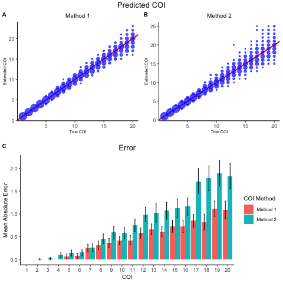
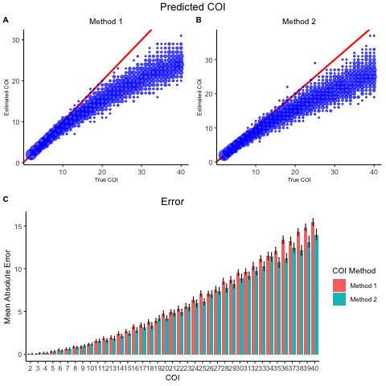
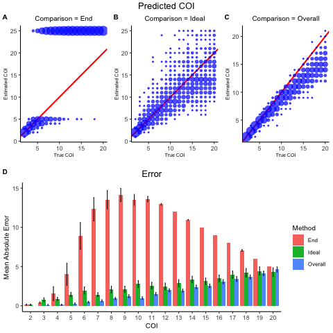
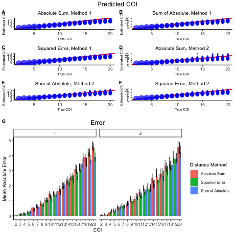
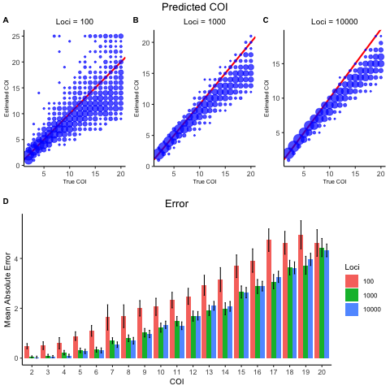
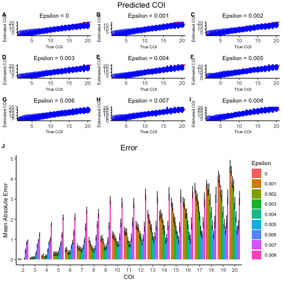
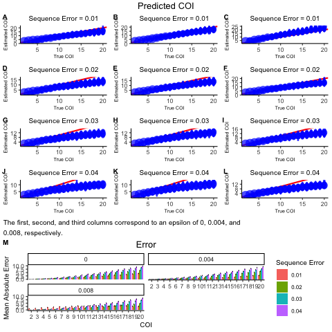

```{r setup, include = FALSE}
# Here, we set default options for our markdown file
knitr::opts_chunk$set(
  comment = "#>",
  tidy = TRUE,
  tidy.opts = list(width.cutoff = 80),
  warning = FALSE,
  fig.width = 7, 
  fig.height = 7
)

# The following two variables control which chunks are run. Either the tests are
# run and the stored images not printed or the tests can not be run and stored 
# images printed. To run the tests, set eval_tests to TRUE. To print the stored
# images, set eval_tests to FALSE.
eval_tests  = FALSE
eval_images = !eval_tests

# N.B. to save the plots, we can use the following code. Write this after the
# call to sensitivity_plot().
# %>% ggpubr::ggexport(filename = "analysis/vignettes/figures/discrete/sensitivity_plots/toverall_image.png")
# %>% ggpubr::ggexport(filename = "analysis/vignettes/figures/discrete/error_images/toverall_error.png")

library(coiaf)
```

## Introduction

In this analysis file, we aim to understand the effect of varying parameters on
our COI framework. The parameters that we will examine are:

* `comparison`: The method to be employed. One of `"end"`, `"ideal"`, `"overall"`.
* `distance`: The distance method used to determine the distance between the 
theoretical and simulated curves for the `"overall"` method. One of `"abs_sum"`, 
`"sum_abs"`, `"squared"`.
* `weighted`: An indicator indicating whether to compute weighted distance.
* `coverage`: Coverage at each locus.
* `loci`: The number of loci.
* `alpha`: Shape parameter of the symmetric Dirichlet prior on strain proportions.
* `overdispersion`: The extent to which counts are over-dispersed relative to the 
binomial distribution. Counts are Beta-binomially distributed, with the beta 
distribution having shape parameters $p/\text{overdispersion}$ and 
$(1-p) / \text{overdispersion}$.
* `epsilon`: The probability of a single read being miscalled as the other allele.
Applies in both directions.
* `seq_error`: The level of sequencing error that is assumed.

In addition, we will compare two different methods of determining the COI.
The first method uses the mean number of variant sites, binned in groups of 
increasing PLAF to infer COI. The second method compares the WSAF to the PLAF 
for only the sites that are heterogeneous.

### Default Parameters

| Parameter       | Default Value         |
|:---------------:|:---------------------:|
| COI             | `3`                   |
| Max COI         | `25`                  |
| PLAF            | `runif(1000, 0, 0.5)` |
| Coverage        | `200`                 |
| Alpha           | `1`                   |
| Overdispersion  | `0`                   |
| Epsilon         | `0`                   |
| Sequence Error  | `0.01`                |
| Cut             | `seq(0, 0.5, 0.01)`   |
| Comparison      | `"overall"`           |
| Distance        | `"squared"`           |
| Weighted        | `TRUE`                |


### Setting our PLAF
```{r initialization, eval = eval_tests}
# Set the seed
set.seed(1)

# Define number of loci, and distribution of minor allele frequencies
L <- 1e3
p <- rbeta(L, 1, 5)
p[p > 0.5] <- 1 - p[p > 0.5]
```

### Overall Performance
```{r overall, eval = eval_tests}
toverall <- sensitivity(coi = 1:25, max_coi = 30, repetitions = 10, plaf = p,
                        coverage = 200, seq_error = 0, coi_method = c("1", "2"))

toverall_image <- sensitivity_plot(data = toverall, dims = c(2, 1), 
                                   title = "Predicted COI", 
                                   sub_title = c("Method 1", "Method 2"))

toverall_error <- error_plot(toverall, fill = "coi_method", 
                             legend_title = "COI Method", 
                             title = "Error",
                             fill_levels = c("Method 1", "Method 2"))

toverall_fig <- ggpubr::ggarrange(toverall_image, toverall_error, 
                                  labels = "AUTO")
toverall_fig
```

```{r overall image, eval = eval_images, echo = F, out.width = "75%"}

```

## Sensitivity Analysis

### COI
We first want to understand for what range our model can accurately predict
the COI.

```{r coi, eval = eval_tests}
tcoi <- sensitivity(coi = 2:40, max_coi = 40, repetitions = 10, plaf = p,
                    coi_method = c("1", "2"))

tcoi_image <- sensitivity_plot(data = tcoi, dims = c(2, 1), 
                               title = "Predicted COI", 
                               sub_title = c("Method 1", "Method 2"))

tcoi_error <- error_plot(tcoi, fill = "coi_method", 
                         legend_title = "COI Method", 
                         title = "Error",
                         fill_levels = c("Method 1", "Method 2"))

tcoi_fig <- ggpubr::ggarrange(tcoi_image, tcoi_error, labels = "AUTO") 
tcoi_fig
```

```{r coi image, eval = eval_images, echo = F, out.width = "75%"}

```

Based on the above set of runs, it appears that the algorithm performs well for
a very large range of COIs. We see that as the true COI increases, the error
and bias likewise increase. However, even at a COI of 40, the error and bias are
small, at roughly 4 and -4, respectively. It is interesting to note that our
bias is always negative. This indicates that the algorithm consistently 
underpredicts the COI.

The fact that our model struggles with larger COIs makes sense as at that point,
the theoretical COI curves are essentially identical. Although it is remarkable
that the algorithm performs this well at COIs that large, COIs of greater than 
20 are somewhat unrealistic. For the rest of this document, we only consider 
COIs of 2 till 20.

### Comparison
```{r comparison, eval = eval_tests}
tcomparison <- sensitivity(coi = 2:20, plaf = p, 
                           comparison = c("end", "ideal", "overall"),
                           distance = "squared", repetitions = 10)

tcomparison_image <- 
  sensitivity_plot(data = tcomparison,
                   title = "Predicted COI",
                   dims = c(3, 1),
                   sub_title = paste0("Comparison = ", c("End", 
                                                         "Ideal", 
                                                         "Overall")))

tcomparison_error <- error_plot(tcomparison, fill = "comparison", 
                                legend_title = "Method", 
                                fill_levels = c("End", "Ideal", "Overall"),
                                title = "Error")

tcomparison_fig <- ggpubr::ggarrange(tcomparison_image, tcomparison_error, 
                                     labels = "AUTO") 
tcomparison_fig
```

```{r method image, eval = eval_images, echo = F, out.width = "75%"}

```

Looking at the images for the three methods: `end`, `ideal`, `overall`, it is
clear that the `end` method does not perform particularly well. For low COI
values, more specifically a COI of below 5, the method is accurate. However, 
with a COI of greater than 5, the algorithm consistently over predicts the COI.

The `ideal` method, on the other hand performs quite well. For every COI, it 
will for some runs predict the correct COI. However, the distribution is quite 
large and the model does not consistently predict the same COI.

The `overall` method seems to perform the best. It does underpredict the COI for 
large COI values but the variance in the prediction is less than in the `ideal`
method.

Based on these results, it seem that the `ideal` method and the `overall` method
are the best. Which one is better is debatable, but for the rest of this 
document, we will use the `overall` method.

### Distance
```{r distance, eval = eval_tests}
tdistance <- sensitivity(coi = 2:20, plaf = p, comparison = "overall",
                         distance = c("abs_sum", "sum_abs", "squared"),
                         repetitions = 10, coi_method = c("1", "2"))

tdistance_image <- 
  sensitivity_plot(data = tdistance,
                   title = "Predicted COI",
                   dims = c(3, 2),
                   sub_title = paste(rep(c("Absolute Sum", 
                                           "Sum of Absolute", 
                                           "Squared Error"), 
                                         2),
                                     rep(c("Method 1", "Method 2"), each = 3), 
                                     sep = ", "))

tdistance_error <- error_plot(tdistance, fill = "distance", 
                              legend_title = "Distance Method", 
                              fill_levels = c("Absolute Sum", 
                                              "Squared Error", 
                                              "Sum of Absolute"),
                              title = "Error",
                              second_fill = "coi_method")

tdistance_fig <- ggpubr::ggarrange(tdistance_image, tdistance_error, 
                                   labels = "AUTO")
tdistance_fig
```

```{r distance image, eval = eval_images, echo = F, out.width = "75%"}

```

### Weighted
```{r weight, eval = eval_tests}
tweight <- sensitivity(coi = 2:20, weighted = c(FALSE, TRUE),
                       distance = "squared", plaf = p, repetitions = 10,
                       coi_method = c("1", "2"))

tweight_image <- 
  sensitivity_plot(data = tweight,
                   title = "Predicted COI",
                   dims = c(2, 2),
                   sub_title = 
                   paste(rep(c("Not Weighted", "Weighted"), 2),
                         rep(c("Method 1", "Method 2"), each = 2), sep = ", "))

tweight_error <- error_plot(tweight, fill = "coi_method", 
                            fill_levels = c("1", "2"),
                            legend_title = "COI Method", 
                            title = "Error",
                            second_fill = "weighted")

tweight_fig <- ggpubr::ggarrange(tweight_image, tweight_error, labels = "AUTO") 
tweight_fig
```

```{r weight image, eval = eval_images, echo = F, out.width = "75%"}
knitr::include_graphics('figures/discrete/tweight.png')
```

Comparing weighted to non-weighted distance metrics, it appears that there is
not a large difference between the algorithm's performance. In general, it 
appears that by weighing the distance, the algorithm does not underpredict as
often, but the difference is very small.

### Coverage
```{r coverage, eval = eval_tests}
tcoverage <- sensitivity(coi = 2:20, coverage = c(25, 50, 100, 200, 400, 800), 
                         repetitions = 10, plaf = p, coi_method = c("1", "2"))

tcoverage_image <- 
  sensitivity_plot(data = tcoverage,
                   title = "Predicted COI",
                   dims = c(4, 3),
                   sub_title = paste(paste0("Coverage ", c(25, 50, 100, 200, 400, 800)),
                                     rep(c("Method 1", "Method 2"), each = 6),
                                     sep = ", "))

tcoverage_error <- error_plot(tcoverage, fill = "coverage", 
                              legend_title = "Coverage", 
                              title = "Error",
                              second_fill = "coi_method")

tcoverage_fig <- ggpubr::ggarrange(tcoverage_image, tcoverage_error, 
                                   labels = "AUTO")
tcoverage_fig
```

```{r coverage image, eval = eval_images, echo = F, out.width = "75%"}

```

It can be seen, based on the figures, that the lower the coverage is, the worse
our algorithm does. With a coverage greater than 100, however, there is not a
noticeable difference in performance.

### Loci
```{r loci method 1, eval = eval_tests}
# Set the range over which we will iterate
loci = c(1e3, 1e4)

# For each loci, reset the PLAF and then run
bloci <- lapply(loci, function(new_L){
  new_p <- rbeta(new_L, 1, 5)
  new_p[new_p > 0.5] <- 1 - new_p[new_p > 0.5]
  
  inner_tloci <- sensitivity(coi = 2:20, repetitions = 10, plaf = new_p,
                             coi_method = "1")
  inner_tloci$param_grid$loci <- new_L
  return(inner_tloci)
})

# Extract the relevant information for each output: predicted_coi, probability, 
# param_grid, and boot_error
pc = do.call(cbind, lapply(bloci, function(test){ return(test$predicted_coi) }))
pb = do.call(cbind, lapply(bloci, function(test){ return(test$probability) }))
pg = do.call(rbind, lapply(bloci, function(test){ return(test$param_grid) }))
be = do.call(rbind, lapply(bloci, function(test){ return(test$boot_error) }))

# Fix the naming for predicted_coi
num_cois = length(unique(pg$coi))
num_repeat_cois = length(pg$coi) / num_cois
names(pc) = paste("coi", pg$coi, rep(seq(num_repeat_cois), each = num_cois), sep="_")

# Create the output
tloci_1 <- list(
  predicted_coi = pc,
  probability   = pb,
  param_grid    = pg,
  boot_error    = be
)

# Plot
tloci_image_1 <- 
  sensitivity_plot(data = tloci_1,
                   title = "Predicted COI",
                   dims = c(2, 1),
                   sub_title = paste0("Loci = ", c(1e3, 1e4)))

# Add a loci column
tloci_1$boot_error$loci <- rep(c(1e3, 1e4), 
                             each = length(unique(tloci_1$boot_error$coi)))
tloci_error_1 <- error_plot(tloci_1, fill = "loci", 
                            legend_title = "Loci", 
                            title = "Error")

tloci_fig_1 <- ggpubr::ggarrange(tloci_image_1, tloci_error_1, labels = "AUTO")
tloci_fig_1
```

```{r loci image method 1, eval = eval_images, echo = F, out.width = "75%"}

```

```{r loci method 2, eval = eval_tests}
# Set the range over which we will iterate
loci = c(1e3, 1e4)

# For each loci, reset the PLAF and then run
bloci <- lapply(loci, function(new_L){
  new_p <- rbeta(new_L, 1, 5)
  new_p[new_p > 0.5] <- 1 - new_p[new_p > 0.5]
  
  inner_tloci <- sensitivity(coi = 2:20, repetitions = 10, plaf = new_p, 
                             coi_method = "2")
  inner_tloci$param_grid$loci <- new_L
  return(inner_tloci)
})

# Extract the relevant information for each output: predicted_coi, probability, 
# param_grid, and boot_error
pc = do.call(cbind, lapply(bloci, function(test){ return(test$predicted_coi) }))
pb = do.call(cbind, lapply(bloci, function(test){ return(test$probability) }))
pg = do.call(rbind, lapply(bloci, function(test){ return(test$param_grid) }))
be = do.call(rbind, lapply(bloci, function(test){ return(test$boot_error) }))

# Fix the naming for predicted_coi
num_cois = length(unique(pg$coi))
num_repeat_cois = length(pg$coi) / num_cois
names(pc) = paste("coi", pg$coi, rep(seq(num_repeat_cois), each = num_cois), sep="_")

# Create the output
tloci_2 <- list(
  predicted_coi = pc,
  probability   = pb,
  param_grid    = pg,
  boot_error    = be
)

# Plot
tloci_image_2 <- 
  sensitivity_plot(data = tloci_2,
                   title = "Predicted COI",
                   dims = c(2, 1),
                   sub_title = paste0("Loci = ", c(1e3, 1e4)))

# Add a loci column
tloci_2$boot_error$loci <- rep(c(1e3, 1e4), 
                             each = length(unique(tloci_2$boot_error$coi)))
tloci_error_2 <- error_plot(tloci_2, fill = "loci", 
                            legend_title = "Loci", 
                            title = "Error")

tloci_fig_2 <- ggpubr::ggarrange(tloci_image_2, tloci_error_2, labels = "AUTO")
tloci_fig_2
```

```{r loci image method 2, eval = eval_images, echo = F, out.width = "75%"}

```

### Alpha
```{r alpha method 1, eval = eval_tests}
talpha_1 <- sensitivity(coi = 2:20, alpha = seq(0.01, 5.51, 0.5), 
                        repetitions = 10, plaf = p)

talpha_image_1 <- 
  sensitivity_plot(data = talpha_1,
                   title = "Predicted COI",
                   dims = c(4, 3),
                   sub_title = paste0("Alpha = ", seq(0.01, 5.51, 0.5)))

talpha_error_1 <- error_plot(talpha_1, fill = "alpha", 
                             legend_title = "Alpha", 
                             title = "Error")

talpha_fig_1 <- ggpubr::ggarrange(talpha_image_1, talpha_error_1, 
                                  labels = "AUTO")
talpha_fig_1
```

```{r alpha image method 1, eval = eval_images, echo = F, out.width = "75%"}

```

```{r alpha method 2, eval = eval_tests}
talpha_2 <- sensitivity(coi = 2:20, alpha = seq(0.01, 5.51, 0.5), 
                        repetitions = 10, plaf = p)

talpha_image_2 <- 
  sensitivity_plot(data = talpha_2,
                   title = "Predicted COI",
                   dims = c(4, 3),
                   sub_title = paste0("Alpha = ", seq(0.01, 5.51, 0.5)))

talpha_error_2 <- error_plot(talpha_2, fill = "alpha", 
                             legend_title = "Alpha", 
                             title = "Error")

talpha_fig_2 <- ggpubr::ggarrange(talpha_image_2, talpha_error_2, 
                                  labels = "AUTO")
talpha_fig_2
```

```{r alpha image method 2, eval = eval_images, echo = F, out.width = "75%"}
knitr::include_graphics('figures/discrete/talpha_2.png')
```

### Overdispersion
```{r overdispersion, eval = eval_tests}
tover <- sensitivity(coi = 2:20, overdispersion = seq(0, 0.2, 0.05), 
                     repetitions = 10, plaf = p, coi_method = c("1", "2"))

tover_image <- 
  sensitivity_plot(data = tover,
                   title = "Predicted COI",
                   dims = c(4, 3),
                   sub_title = paste(paste0("Over ", seq(0, 0.2, 0.05)),
                                     rep(c("Method 1", "Method 2"), each = 5),
                                     sep = ", "))

tover_error <- error_plot(tover, fill = "overdispersion", 
                          legend_title = "Overdispersion", 
                          title = "Error",
                          second_fill = "coi_method")

tover_fig <- ggpubr::ggarrange(tover_image, tover_error, labels = "AUTO")
tover_fig
```

```{r overdispersion image, eval = eval_images, echo = F, out.width = "75%"}

```

When you introduce overdispersion, models perform poorly. Any overdispersion 
causes a large drop in accuracy. This drop in accuracy is caused by the model
consistently underpredicting the COI by a large amount.

### Epsilon
```{r epsilon, eval = eval_tests}
tepsilon <- sensitivity(coi = 2:20, epsilon = seq(0, 0.008, 0.001), 
                        repetitions = 10, plaf = p)

tepsilon_image <- 
  sensitivity_plot(data = tepsilon,
                   title = "Predicted COI",
                   dims = c(3, 3),
                   sub_title = paste0("Epsilon = ", seq(0, 0.008, 0.001)))

tepsilon_error <- error_plot(tepsilon, fill = "epsilon", 
                             legend_title = "Epsilon", 
                             title = "Error")

tepsilon_fig <- ggpubr::ggarrange(tepsilon_image, tepsilon_error, 
                                  labels = "AUTO")
tepsilon_fig
```

```{r epsilon image, eval = eval_images, echo = F, out.width = "75%"}

```

The algorithm performs best at an epsilon value of 0. As epsilon becomes larger,
the model greatly overpredicts the COI. This can be seen for an epsilon of 
0.008, where the COI is almost always predicted to be 25, the maximum allowable
COI for these tests.

### Sequencing Error
```{r seq error, eval = eval_tests}
tseq <- sensitivity(coi = 2:20, epsilon = seq(0, 0.008, 0.004), 
                    seq_error = seq(0, 0.04, 0.01)[-1], 
                    repetitions = 10, plaf = p)

ep_title <- rep(paste0("Epsilon=", seq(0, 0.008, 0.004)), 2) 
seq_title <- rep(paste0("Sequence Error = ", seq(0, 0.04, 0.01)[-1]), each = 3)

tseq_image <- 
  sensitivity_plot(data = tseq,
                   title = "Predicted COI",
                   dims = c(4, 3),
                   sub_title = seq_title,
                   caption = stringr::str_wrap("The first, second, and third 
                                               columns correspond to an epsilon
                                               of 0, 0.004, and 0.008, 
                                               respectively."))

tseq_error <- error_plot(tseq, fill = "seq_error", 
                         legend_title = "Sequence Error", 
                         title = "Error",
                         second_fill = "epsilon")

tseq_fig <- ggpubr::ggarrange(tseq_image, tseq_error, labels = "AUTO")
tseq_fig
```

```{r seq error image, eval = eval_images, echo = F, out.width = "75%"}

```

Interestingly, having no sequence error causes problems in the algorithm. Based
off the figure, it is clear that introducing some sequence error does combat
issues introduced by the value of epsilon. However, if the sequence error is too
large, the model starts to underpredict the COI.

```{r save results, eval = eval_tests, echo = FALSE}
# Below, we save the runs we performed for future use
saved_analysis <- list(toverall, tcoi, tcomparison, tdistance, tweight, 
                       tcoverage, tloci_1, tloci_2, talpha_1, talpha_2,  tover,
                       tepsilon, tseq)

names(saved_analysis) <- list("toverall", "tcoi", "tcomparison", "tdistance", 
                              "tweight", "tcoverage", "tloci_1", "tloci_2", 
                              "talpha_1", "talpha_2", "tover", "tepsilon", 
                              "tseq")

saveRDS(saved_analysis, file = "saved_analysis_discrete.rds")

# Here, we update all the stored images
update_images <- list(toverall_fig, tcoi_fig, tcomparison_fig, tdistance_fig, 
                      tweight_fig, tcoverage_fig, tloci_fig_1, tloci_fig_2, 
                      talpha_fig_1, talpha_fig_2, tover_fig, tepsilon_fig, 
                      tseq_fig)
names(update_images) <- list("toverall", "tcoi", "tcomparison", "tdistance", 
                             "tweight", "tcoverage", "tloci_1", "tloci_2", 
                             "talpha_1", "talpha_2", "tover", "tepsilon", 
                             "tseq")

for (i in seq_len(length(update_images))){
  filename = paste0("figures/discrete/", 
                    names(update_images)[i], 
                    ".png")
  suppressMessages(update_images[i] %>% ggpubr::ggexport(filename = filename))
}
```

