```{r setup, include = FALSE}
# Here, we set default options for our markdown file
knitr::opts_chunk$set(
  comment = "#>",
  tidy = TRUE,
  tidy.opts = list(width.cutoff = 80)
)

# The following two variables control which chunks are run. Either the tests are
# run and the stored images not printed or the tests can not be run and stored 
# images printed. To run the tests, set eval_tests to TRUE. To print the stored
# images, set eval_tests to FALSE.
eval_tests  = FALSE
eval_images = !eval_tests

library(coiaf)
```

# Introduction

In this analysis file, we aim to understand the effect of varying parameters on
our COI framework. The parameters that we will examine are:

* method: The method to be employed. One of `"end"`, `"ideal"`, `"overall"`.
* dist_method: The distance method used to determine the distance between the 
theoretical and simulated curves for the `"overall"` method. One of `"abs_sum"`, 
`"sum_abs"`, `"squared"`, `"KL"`.
* weighted: An indicator indicating whether to compute weighted distance.
* coverage: Coverage at each locus.
* loci: The number of loci.
* alpha: Shape parameter of the symmetric Dirichlet prior on strain proportions.
* overdispersion: The extent to which counts are over-dispersed relative to the 
binomial distribution. Counts are Beta-binomially distributed, with the beta 
distribution having shape parameters $p/\text{overdispersion}$ and 
$(1-p) / \text{overdispersion}$.
* epsilon: The probability of a single read being miscalled as the other allele.
Applies in both directions.
* seq_error: The level of sequencing error that is assumed.

A note of caution, in order to visualize the following tests, `ggplot2` and
`ggpubr` must be installed.

## Default Parameters

| Parameter       | Default Value         |
|:---------------:|:---------------------:|
| COI             | `3`                   |
| Max COI         | `25`                  |
| PLAF            | `runif(1000, 0, 0.5)` |
| Coverage        | `100`                 |
| Alpha           | `1`                   |
| Overdispersion  | `0`                   |
| Epsilon         | `0`                   |
| Sequence Error  | `0.01`                |
| Cut             | `seq(0, 0.5, 0.01)`   |
| Method          | `"overall"`           |
| Distance Method | `"squared"`           |
| Weighted        | `TRUE`                |


## Setting our PLAF
```{r initialization, eval = eval_tests}
# Set the seed
set.seed(1)

# Define number of loci, and distribution of minor allele frequencies
L <- 1e3
p <- rbeta(L, 1, 5)
p[p > 0.5] <- 1 - p[p > 0.5]
```

# Sensitivity Analysis

## COI
We first want to understand for what range our model can accurately predict
the COI.

```{r coi, eval = eval_tests}
tcoi <- coi_test(COI = 2:40, max_COI = 40, repetitions = 100, PLAF = p)

tcoi_image <- sensitivity_plot(data = tcoi, plot_dims = c(1, 1), title = "COI")
tcoi_image 

tcoi_error <- error_plot(tcoi, legend.position = "none")
tcoi_error

# N.B. to save the plots, we can use the following code. Write this after the
# call to sensitivity_plot().
# %>% ggpubr::ggexport(filename = "analysis/Sensitivity Analysis Figures/Sensitivity Plots/tcoi_image.png")
# %>% ggpubr::ggexport(filename = "analysis/Sensitivity Analysis Figures/Error Images/tcoi_error.png")
```

```{r coi image, eval = eval_images, echo = F, out.width = "75%"}
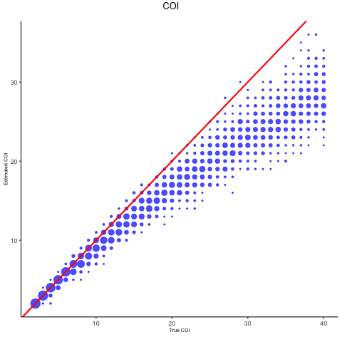
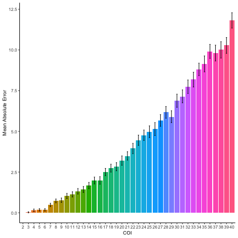
```

Based on the above set of runs, it appears that the algorithm performs well for
a very large range of COIs. We see that as the true COI increases, the error
and bias likewise increase. However, even at a COI of 40, the error and bias are
small, at roughly 4 and -4, respectively. It is interesting to note that our
bias is always negative. This indicates that the algorithm consistently 
underpredicts the COI.

The fact that our model struggles with larger COIs makes sense as at that point,
the theoretical COI curves are essentially identical. Although it is remarkable
that the algorithm performs this well at COIs that large, COIs of greater than 
20 are somehwat unrealistic. For the rest of this document, we only consider 
COIs of 2 till 20.

## Method
```{r method, eval = eval_tests}
tmethod <- coi_test(COI = 2:20, PLAF = p, method = c("end", "ideal", "overall"),
                    dist_method = "squared", repetitions = 100)

tmethod_image <- 
  sensitivity_plot(data = tmethod,
                   plot_dims = c(3, 1),
                   change_param = "Method = ",
                   change_param_val = c("End", "Ideal", "Overall"))
tmethod_image

tmethod_error <- error_plot(tmethod, fill = "method", legend_title = "Method", 
                            fill_levels = c("End", "Ideal", "Overall"),
                            title = "Error Plot for Method")
tmethod_error
```

```{r method image, eval = eval_images, echo = F, out.width = "75%"}
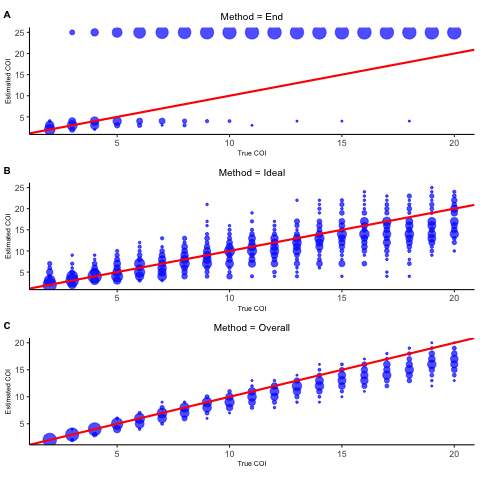
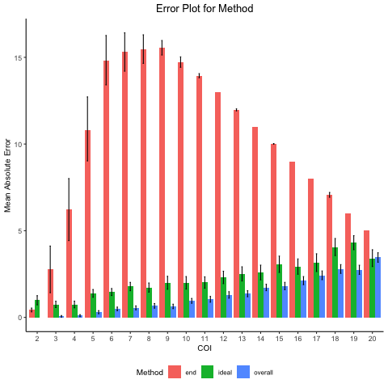
```

Looking at the images for the three methods: `end`, `ideal`, `overall`, it is
clear that the `end` method does not perform particularly well. For low COI
values, more specifically a COI of below 5, the method is accurate. However, 
with a COI of greater than 5, the algorithm consistently over predicts the COI.

The `ideal` method, on the other hand performs quite well. For every COI, it will
for some runs predict the correct COI. However, the distribution is quite large
and the model does not consistently predict the same COI.

The `overall` method seems to perform the best. It does underpredict the COI for 
large COI values but the variance in the prediction is less than in the `ideal`
method.

Based on these results, it seem that the `ideal` method and the `overall` method
are the best. Which one is better is debatable, but for the rest of this 
docuement, we will use the `overall` method.

## Distance Method
```{r distance, eval = eval_tests}
tdistance <- coi_test(COI = 2:20, PLAF = p, method = "overall",
                      dist_method = c("abs_sum", "sum_abs",
                                      "squared", "KL"),
                      repetitions = 100)

tdistance_image <- 
  sensitivity_plot(data = tdistance,
                   plot_dims = c(2, 2),
                   change_param = "Distance Method = ",
                   change_param_val = c("Absolute Sum", "Sum of Absolute",
                                        "Squared Error", "KL Divergence"))
tdistance_image

tdistance_error <- error_plot(tdistance, fill = "dist_method", 
                              legend_title = "Distance Method", 
                              fill_levels = c("Absolute Sum", "KL Divergence",
                                              "Squared Error", "Sum of Absolute"),
                              title = "Error Plot for Distance Method")
tdistance_error
```

```{r distance image, eval = eval_images, echo = F, out.width = "75%"}
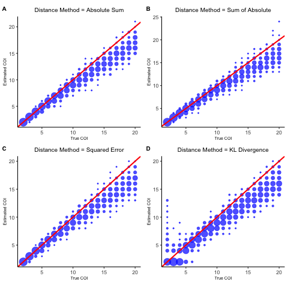
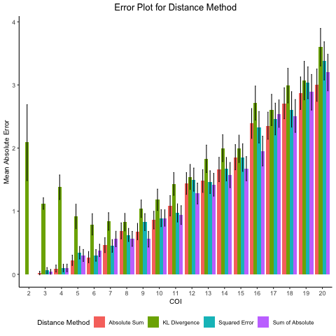
```

All of the distance metrics, other than KL divergence, perform quite well for
all values of the COI. The KL divergecne, although it too performs well, it 
struggles for low COI values. In some cases the KL method overpredicts and in 
some cases underpredicts by a large amount. For a COI of 2, for example, the 
algorithm predicts COI's much higher than the true COI, in some cases even 
predicting a COI of 12.

## Weighted
```{r weight, eval = eval_tests}
tweight <- coi_test(COI = 2:20, weighted = c(FALSE, TRUE),
                    dist_method = c("abs_sum", "sum_abs",
                                      "squared", "KL"),
                    PLAF = p, repetitions = 100)

tweight_image <- 
  sensitivity_plot(data = tweight,
                   plot_dims = c(2, 4),
                   change_param_val = 
                   paste(rep(c("Abs Sum", "Sum Abs", "Squared", "KL"), 2),
                         rep(c("Not Weighted", "Weighted"), each = 4)))
tweight_image

tweight_error <- error_plot(tweight, fill = "dist_method", 
                            fill_levels = c("Absolute Sum", "KL Divergence",
                                              "Squared Error", "Sum of Absolute"),
                            legend_title = "Distance Method", 
                            title = "Error Plot for Weight",
                            second_fill = "weighted")
tweight_error
```

```{r weight image, eval = eval_images, echo = F, out.width = "75%"}
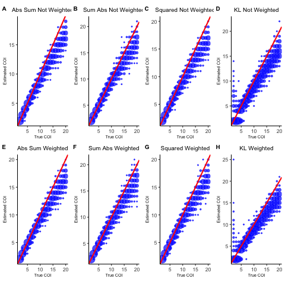
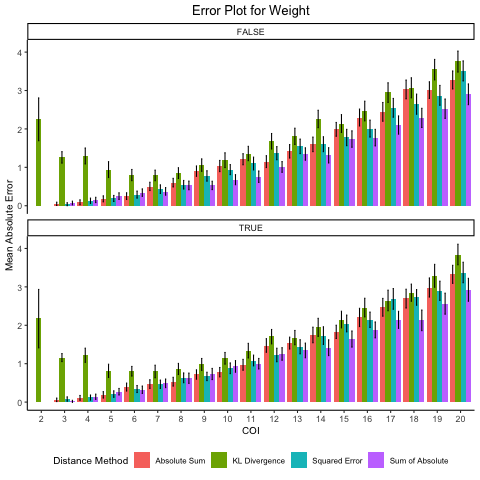
```

Comparing weighted to non-weighted distance metrics, it appears that there is
not a large difference between the algorithm's performance. In general, it 
appears that by weighing the distance, the algorithm does not underpredict as
often, but the difference is very small.

## Coverage
```{r coverage, eval = eval_tests}
tcoverage <- coi_test(COI = 2:20, coverage = c(25, 50, 100, 200, 400, 800), 
                 repetitions = 100, PLAF = p)

tcoverage_image <- 
  sensitivity_plot(data = tcoverage,
                   plot_dims = c(2, 3),
                   change_param = "Coverage = ",
                   change_param_val = c(25, 50, 100, 200, 400, 800))
tcoverage_image

tcoverage_error <- error_plot(tcoverage, fill = "coverage", 
                              legend_title = "Coverage", 
                              title = "Error Plot for Coverage")
tcoverage_error
```

```{r coverage image, eval = eval_images, echo = F, out.width = "75%"}
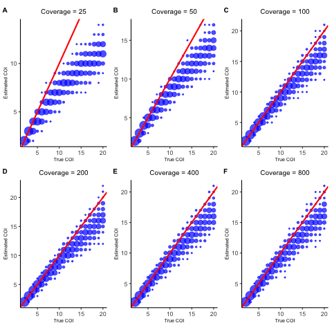
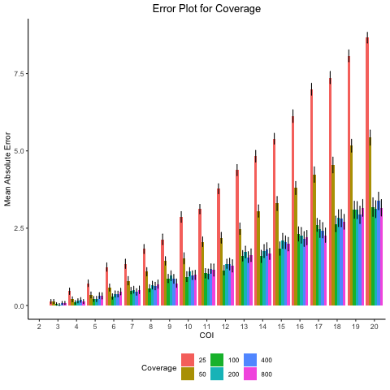
```

It can be seen, based on the figures, that the lower the coverage is, the worse
our algorithm does. With a coverage greater than 100, however, there is not a
noticable difference in performance.

## Loci
```{r loci, eval = eval_tests}
# Set the range over which we will iterate
loci = c(1e3, 1e4)

# For each loci, reset the PLAF and then run
bloci <- lapply(loci, function(new_L){
  new_p <- rbeta(new_L, 1, 5)
  new_p[new_p > 0.5] <- 1 - new_p[new_p > 0.5]
  
  inner_tloci <- coi_test(COI = 2:20, repetitions = 100, PLAF = new_p)
  inner_tloci$param_grid$loci <- new_L
  return(inner_tloci)
})

# Extract the relevant information for each output: predicted_coi, param_grid,
# and boot_error
pc = do.call(cbind, lapply(bloci, function(test){ return(test$predicted_coi) }))
pg = do.call(rbind, lapply(bloci, function(test){ return(test$param_grid) }))
be = do.call(rbind, lapply(bloci, function(test){ return(test$boot_error) }))

# Fix the naming for predicted_coi
num_cois = length(unique(pg$COI))
num_repeat_cois = length(pg$COI) / num_cois
names(pc) = paste("coi", pg$COI, rep(seq(num_repeat_cois), each = num_cois), sep="_")

# Create the output
tloci <- list(
  predicted_coi = pc,
  param_grid    = pg,
  boot_error    = be
)

# Plot
tloci_image <- 
  sensitivity_plot(data = tloci,
                   plot_dims = c(2, 1),
                   change_param_val = paste("Loci = ", c(1e3, 1e4)))
tloci_image

# Add a loci column
tloci$boot_error$loci <- rep(c(1e3, 1e4), 
                             each = length(unique(tloci$boot_error$COI)))
tloci_error <- error_plot(tloci, fill = "loci", 
                          legend_title = "Loci", 
                          title = "Error Plot for Loci")
tloci_error
```

```{r loci image, eval = eval_images, echo = F, out.width = "75%"}
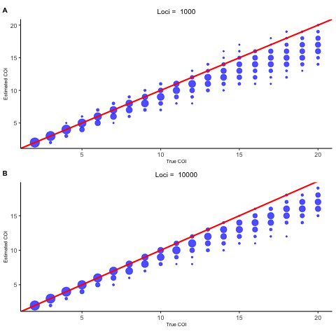
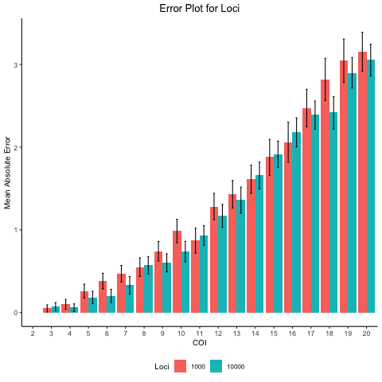
```

## Alpha
```{r alpha, eval = eval_tests}
talpha <- coi_test(COI = 2:20, alpha = seq(0.01, 5.51, 0.5), 
                 repetitions = 100, PLAF = p)

talpha_image <- 
  sensitivity_plot(data = talpha,
                   plot_dims = c(4, 3),
                   change_param = "Alpha = ",
                   change_param_val = seq(0.01, 5.51, 0.5)) 
talpha_image

talpha_error <- error_plot(talpha, fill = "alpha", 
                           legend_title = "Alpha", 
                           title = "Error Plot for Alpha")
talpha_error
```

```{r alpha image, eval = eval_images, echo = F, out.width = "75%"}
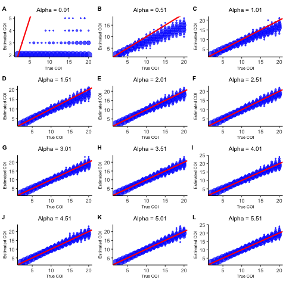
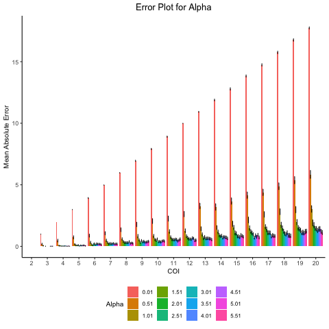
```

The larger the value of alpha is, the better our model performs. Greater than an
alpha of 1.6, however, there is very litte difference. When the alpha is low, 
the model will underpredict the true COI.

## Overdispersion
```{r overdispersion, eval = eval_tests}
tover <- coi_test(COI = 2:20, overdispersion = seq(0, 0.2, 0.05), 
                 repetitions = 100, PLAF = p)

tover_image <- 
  sensitivity_plot(data = tover,
                   plot_dims = c(3, 2),
                   change_param = "Overdispersion = ",
                   change_param_val = seq(0, 0.2, 0.05))
tover_image

tover_error <- error_plot(tover, fill = "overdispersion", 
                          legend_title = "Overdispersion", 
                          title = "Error Plot for Overdispersion")
tover_error
```

```{r overdispersion image, eval = eval_images, echo = F, out.width = "75%"}
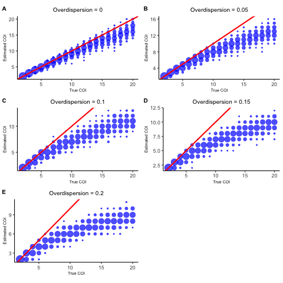
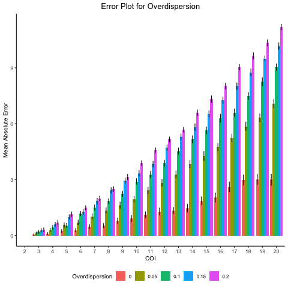
```

When you introduce overdispersion, models perform poorly. Any overdispersion 
causes a large drop in accuracy. This drop in accuracy is caused by the model
consistently underpredicting the COI by a large amount.

## Epsilon
```{r epsilon, eval = eval_tests}
tepsilon <- coi_test(COI = 2:20, epsilon = seq(0, 0.008, 0.001), 
                 repetitions = 100, PLAF = p)

tepsilon_image <- 
  sensitivity_plot(data = tepsilon,
                   plot_dims = c(3, 3),
                   change_param = "Epsilon = ",
                   change_param_val = seq(0, 0.008, 0.001))
tepsilon_image

tepsilon_error <- error_plot(tepsilon, fill = "epsilon", 
                             legend_title = "Epsilon", 
                             title = "Error Plot for Epsilon")
tepsilon_error
```

```{r epsilon image, eval = eval_images, echo = F, out.width = "75%"}
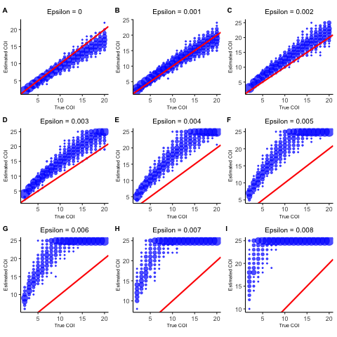
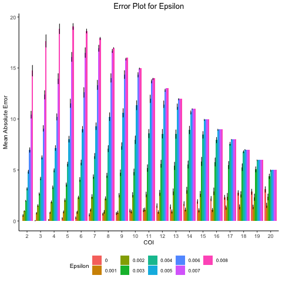
```

The algorithm performs best at an epsilon value of 0. As epislon becomes larger,
the model greatly overpredicts the COI. This can be seen for an epsilon of 
0.008, where the COI is almost always predicted to be 25, the maximum allowable
COI for these tests.

## Sequencing Error
```{r seq error, eval = eval_tests}
tseq <- coi_test(COI = 2:20, epsilon = seq(0, 0.008, 0.004), 
                 seq_error = seq(0, 0.04, 0.01)[-1], 
                 repetitions = 100, PLAF = p)

ep_title <- rep(paste0("Epsilon=", seq(0, 0.008, 0.004)), 2) 
seq_title <- rep(paste0("Sequence Error = ", seq(0, 0.04, 0.01)[-1]), each = 3)

tseq_image <- 
  sensitivity_plot(data = tseq,
                   plot_dims = c(4, 3),
                   change_param_val = seq_title,
                   caption = strwrap("The first, second, and third columns 
                                     correspond to an epsilon of 0, 0.004, and 
                                     0.008, respectively.", width = 1000))
tseq_image

tseq_error <- error_plot(tseq, fill = "seq_error", 
                         legend_title = "Sequence Error", 
                         title = "Error Plot for Sequence Error",
                         second_fill = "epsilon")
tseq_error
```

```{r seq error image, eval = eval_images, echo = F, out.width = "75%"}
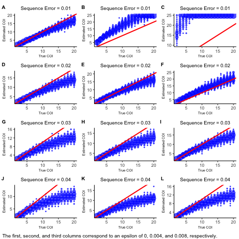
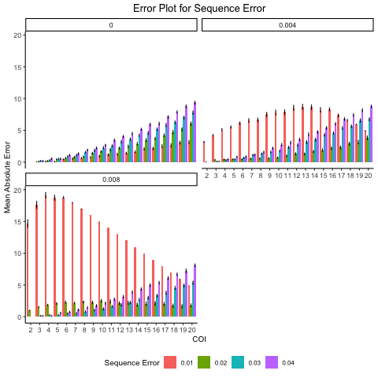
```

Interestingly, having no sequence errror causes problems in the algorithm. Based
off the figure, it is clear that introducing some sequence error does combat
issues intoduced by the value of epsilon. However, if the sequence error is too
large, the model starts to underpredict the COI.

```{r save results, eval = eval_tests, echo = FALSE}
# Below, we save the runs we performed for future use
saved_analysis <- list(tcoi, tmethod, tdistance, tweight, tcoverage, tloci,
                       talpha, tover, tepsilon, tseq)

saved_analysis <- lapply(seq_len(length(saved_analysis)), function(x){
  inner <- lapply(seq_len(length(saved_analysis[[x]])), function(y){
    return(saved_analysis[[x]][[y]] %>% 
             tidyr::unnest(cols = names(saved_analysis[[x]][[y]])))
  })
  names(inner) <- names(saved_analysis[[x]])
  return(inner)
})

names(saved_analysis) <- list("tcoi", "tmethod", "tdistance", "tweight", 
                              "tcoverage", "tloci", "talpha", "tover", 
                              "tepsilon", "tseq")

saveRDS(saved_analysis, file = "saved_analysis.rds")

# Here, we update all the stored images
update_images <- list(tcoi_image, tmethod_image, tdistance_image, tweight_image,
                      tcoverage_image, tloci_image, talpha_image, tover_image, 
                      tepsilon_image, tseq_image)
names(update_images) <- list("tcoi_image", "tmethod_image", "tdistance_image",
                             "tweight_image", "tcoverage_image", "tloci_image", 
                             "talpha_image", "tover_image", "tepsilon_image", 
                             "tseq_image")

for (i in seq_len(length(update_images))){
  filename = paste0("Sensitivity Analysis Figures/Sensitivity Plots/", 
                    names(update_images)[i], 
                    ".png")
  suppressMessages(update_images[i] %>% ggpubr::ggexport(filename = filename))
}

# Here, we update all the stored error images
update_errors <- list(tcoi_error, tmethod_error, tdistance_error, tweight_error,
                      tcoverage_error, tloci_error, talpha_error, tover_error, 
                      tepsilon_error, tseq_error)
names(update_errors) <- list("tcoi_error", "tmethod_error", "tdistance_error",
                             "tweight_error", "tcoverage_error", "tloci_error", 
                             "talpha_error", "tover_error", "tepsilon_error", 
                             "tseq_error")

for (i in seq_len(length(update_errors))){
  filename = paste0("Sensitivity Analysis Figures/Error Images/", 
                    names(update_errors)[i], 
                    ".png")
  suppressMessages(update_errors[i] %>% ggpubr::ggexport(filename = filename))
}
```
